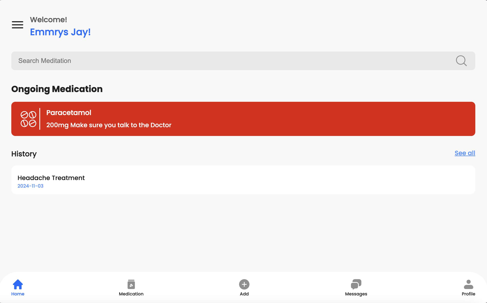

# MedBuddy Backend

**MedBuddy** is an web application designed to help patients adhere to their medication schedules. By storing dosage information and sending timely reminders, MedBuzz ensures patients can follow their prescribed treatments more effectively, and a medical practitioner can monitor the progress of each of his/her patients.

## Table of Contents

1. [Project Overview](#project-overview)
2. [Features](#features)
3. [Technology Stack](#technology-stack)
4. [Architecture](#architecture)
5. [Setup & Installation](#setup--installation)
6. [Usage](#usage)
7. [Deployment](#deployment)
8. [Contact](#contact)

---

### Project Overview

Medication adherence is critical for patient health, especially for chronic conditions. MedBuddy is designed to simplify the process by providing a digital solution that reminds users of medication times, tracks their adherence, and allows them and medical practitioners to review their progress. 

### Features

- **Medication Scheduling**: Schedule multiple medications with specific dosages and times.
- **Reminders & Notifications**: Timely email alerts for each medication, customizable by the user.
- **History & Progress Tracking**: Track medication intake history for better adherence insights.
- **User-Friendly Interface**: Clean and accessible UI for ease of use.
- **Secure Storage**: Protects user data and medication schedules.

### Technology Stack

- **Backend**: [Golang](https://golang.org/)
- **Database**: [MongoDB](https://www.mongodb.org/)
- **Email Notifications**: [MailGun](https://www.mailgun.com/)
- **Cron Jobs**: [Cron Jobs]()

### Architecture

This project follows a strongly decoupled hexagonal structure written
in Go. It was generated from this package: [https://github.com/emmrys-jay/hexy-go](https://github.com/emmrys-jay/hexy-go)

### Setup & Installation
This Setup does not involve configuring email notification

1. **Clone the repository**:
   ```bash
   git clone https://github.com/your-username/medbuddy-backend.git
   cd medbuddy-backend
   ```

2. **Install dependencies**:

   - **Backend**:
     ```bash
     go mod tidy
     ```

3. **Environment Variables**:
   - Create a `.env` file in the root directory and add:
     ```plaintext
     MONGO_HOST=<connection-string-to-your-mongodb-instance>
     SERVER_PORT=8000
     SECRET_KEY=change-this-in-production
     EMAIL_DOMAIN=<your-email-domain>
     MAILGUN_EMAIL_KEY=<your mail-gun-api-key>
     ```

4. **Run the application**:

   - **Backend**:
     ```bash
     go run main.go
     ```

### Usage

Postman Documentation link: https://documenter.getpostman.com/view/27735481/2sAY52cKVB

To Test out this backend service, the frontend live url is found at 
[https://medbuddy-mvp.vercel.app/](https://medbuddy-mvp.vercel.app/)

The picture below is a screenshot from the live application:




### Deployment

To deploy this service, you’ll need a cloud server, a MongoDB database, and MailGun for email notifications. Here’s a quick overview:

#### 1. Cloud Server

Set up a server on a cloud provider (e.g., [AWS](https://aws.amazon.com/), [Google Cloud](https://cloud.google.com/), [DigitalOcean](https://www.digitalocean.com/)). Alternatively, you can use a cloud server that's easy to set up, such as [Render](https://render.com) or [Railway](https://railway.app). Ensure the server has the necessary resources and access for your app to run smoothly.

#### 2. MongoDB Database

Set up a MongoDB instance on a managed database provider (e.g., [MongoDB Atlas](https://www.mongodb.com/cloud/atlas)) or directly on your server. Make sure MongoDB is configured to accept connections from your server.

#### 3. MailGun for Email Notifications

Sign up at [MailGun](https://www.mailgun.com/) to enable email notifications. Obtain your API key and domain, and add them to your app’s environment variabless.


### Contact

For questions or suggestions, please reach out to [jonathanemma121@gmail.com](mailto:jonathanemma121@gmail.com) or open an issue.

